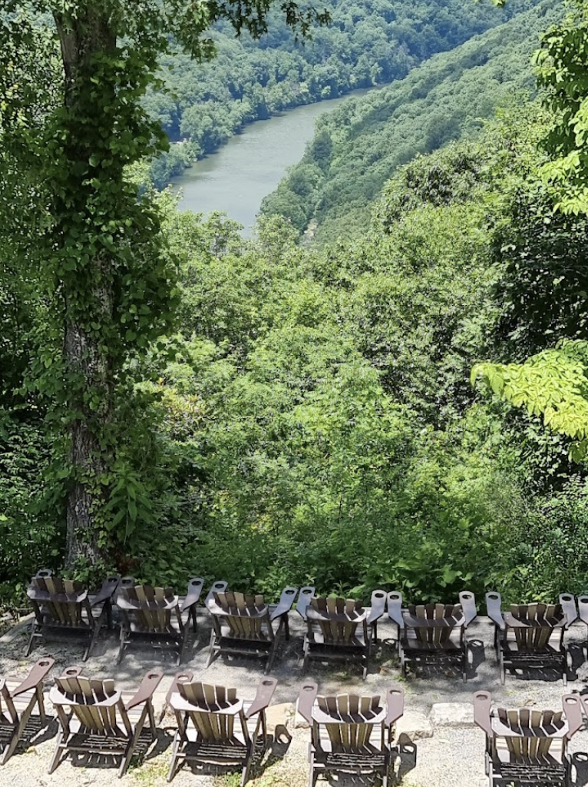

# Adventures on the Gorge

I spent the weekend at Adventures on the Gorge with my girlfriend, Liz. We are both pretty adventurous and wanted this type of thrill. The check-in process was easy, and the front desk folks were very nice. We camped on the resort property the first night in one of the many camping areas. The facilities were pristine and well maintained. Our guide, KP, was extremely knowledgeable and fun to chat with on this trip. Overall, the river and rapids exceeded our expectations, and we would 100% make this trip again. We are already planning for more!

## Deluxe Gauley River Overnight

Let me start by stating that the Gauley River [Deluxe overnight trip](https://adventuresonthegorge.com/whitewater-rafting/deluxe-gauley-river-rafting-overnight/) was fantastic!

## Full Video

<iframe src='https://www.youtube.com/embed/WjidZXbntC0' frameborder='0' allowfullscreen></iframe>

# Sliders at Rendezvous Lodge Bar

We showed up hungry at the [Rendezvous Lodge Bar](https://adventuresonthegorge.com/venue/rendezvous-river-lodge/). So, we went to the bartender to order food, and the only thing on the menu were sliders. The sliders were pretty big, and it was plenty for two people. Not bad for $3 bucks! Not to mention that they were delicious. Excellent beer selection, and the prices were not bad at all.

At the bar, there was also live music playing (@GrizzleyGoat), a good amount of people, and everyone seemed friendly. They have a cornhole area, a fire pit, and a volleyball court. Everything you would expect outdoors to be.

Other dining options:

* [Smokey’s on the Gorge](https://adventuresonthegorge.com/venue/smokeys-on-the-gorge/) - AOTG’s signature restaurant offering casual dining with a great view.
* [Canyon Falls Snack Shack](https://adventuresonthegorge.com/venue/canyon-falls-snack-shack/) - Located at the pool; however, we did not try this place out. 
* [Sweet Java Falls](https://adventuresonthegorge.com/venue/sweet-java-falls/) - Espresso, coffee, bagels, this place has you covered.
* [Chetty’s Pub](https://adventuresonthegorge.com/venue/chettys-pub/) - large deck overlooking the gorge and the after raft watch party location

<iframe sandbox="allow-popups allow-scripts allow-modals allow-forms allow-same-origin" style="width:120px;height:240px;" marginwidth="0" marginheight="0" scrolling="no" frameborder="0" src="//ws-na.amazon-adsystem.com/widgets/q?ServiceVersion=20070822&OneJS=1&Operation=GetAdHtml&MarketPlace=US&source=ss&ref=as_ss_li_til&ad_type=product_link&tracking_id=kit-my_streaming-20&language=en_US&marketplace=amazon&region=US&placement=B0B96H7LGX&asins=B0B96H7LGX&linkId=d22fff55c8041cc39054aa8bb7651452&show_border=true&link_opens_in_new_window=true"></iframe>

# Chetty’s Pub

Chetty’s is a fantastic pub on-site at Adventures on the Gorge. Great views with an outdoor patio. On the patio, you are overlooking the mountains and the river. 

This pub is where they played the rafting videos after the trip. Everyone was super into watching the videos and drinking the beer. A great atmosphere to be around for sure. The burger was delicious, too. 

# The morning of the trip
They asked us to show up an hour early instead of 9:30 AM. We showed up around 8:30 AM. This gave us plenty of time to grab some wet suits (you can rent them on site the morning of - at least we did). We paid $88 for two wet suits and two jackets for two full days. They are a bit cheaper if you rent for a single day. Either way, we are glad we brought them for the first day. The second day was warmer, so there was no need for them. Still worth it. 

Grab the gear from your car that you want to have on the campsite for the overnighter. We just piled it all in the Uhaul. 

If I were to do this a second time, I could have shown up at 9:15 and made the trip with no problem. However, getting there early is best because you never know. 

# Upper Gauley

A little practice run before the rapid. All the rocks have names. “If a rapid is named after you - you did nothing good.” - [@KPRaftGuide](https://www.instagram.com/kpraftguide/?igshid=YmMyMTA2M2Y%3D)

Lost Paddle - Named after the first female raft guide down the Gauley. She lost her paddle. It was hung above the rapid until someone stole it. 

# Camping and Food

Gravel tent area, covered picnic tables, big fire pit. Hot showers. Great food. Lots of beer. Lots of place to party and places to chill and relax. You can even go for a hike. 

  
   

# Lower Gauley

# Ray Ray

Ray Ray all day. This guy was so hilarious that he gets his very own section in this post. I laughed at 100% of his jokes, and he told them nonstop. I would have thought he was a comedian. He’s serious but funny. He made clear that he does not want you to drown on that river. The hand of God will not save you, so swim away from the rocks!
