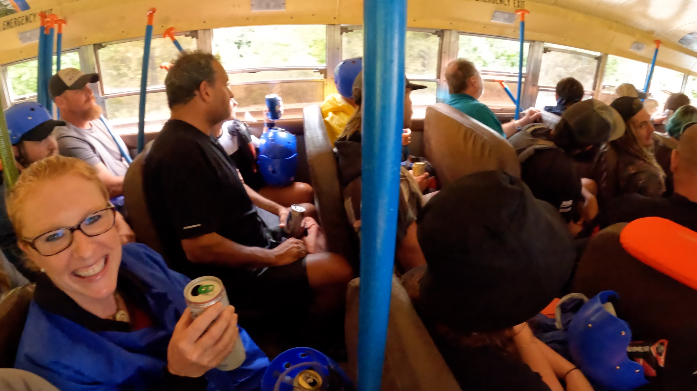

# Adventures on the Gorge

I spent the weekend at Adventures on the Gorge with my girlfriend, Liz. We are both pretty adventurous and wanted this type of thrill. The check-in process was easy, and the front desk folks were very pleasant. We camped on the resort property the first night in one of the many camping areas. The facilities were pristine and well maintained. Our guide, KP, was highly knowledgeable and fun to chat with on this trip. Overall, the river and rapids exceeded our expectations, and we would 100% make this trip again. We are already planning for more!

## Deluxe Gauley River Overnight

Let me start by stating that the Gauley River [Deluxe overnight trip](https://adventuresonthegorge.com/whitewater-rafting/deluxe-gauley-river-rafting-overnight/) was fantastic!

# TLDR Version

* It’s worth it.
* There is plenty of beer. 
* People are super funny and friendly. 
* If you are athletic at all, you don’t need experience. 
* Will you be tossed out of the raft? Most likely. I bet at least 60% of the rafters got tossed out at least once. 
* Camping at the resort is available (lodges too). It’s about $40 a night for basic camping.
* Hot showers at the resort. 
* Hot showers on Delux package. 
* Plenty of parking.

# Sliders at Rendezvous Lodge Bar

After the rafting trip, we were hungry. So we walked to the [Rendezvous Lodge Bar](https://adventuresonthegorge.com/venue/rendezvous-river-lodge/) and ordered sliders. The sliders were pretty big, and it was plenty for two people. Not bad for $3 bucks! The sliders were delicious. Of course, they also had an excellent beer selection and affordable prices.

At the bar, there was also live music playing (@GrizzleyGoat), a good amount of people, and everyone seemed friendly. They have a cornhole area, a fire pit, and a volleyball court. Everything you would expect outdoors to be.

Other dining options:

* [Smokey’s on the Gorge](https://adventuresonthegorge.com/venue/smokeys-on-the-gorge/) - AOTG’s signature restaurant offering casual dining with a great view.
* [Canyon Falls Snack Shack](https://adventuresonthegorge.com/venue/canyon-falls-snack-shack/) - Located at the pool; however, we did not try this place out. 
* [Sweet Java Falls](https://adventuresonthegorge.com/venue/sweet-java-falls/) - Espresso, coffee, bagels, this place has you covered.
* [Chetty’s Pub](https://adventuresonthegorge.com/venue/chettys-pub/) - large deck overlooking the gorge and the after raft watch party location

As an Amazon Associate, I earn from qualifying purchases. I used this battery pack and GoPro Hero 10 to film this adventure.

<iframe sandbox="allow-popups allow-scripts allow-modals allow-forms allow-same-origin" style="width:120px;height:240px;" marginwidth="0" marginheight="0" scrolling="no" frameborder="0" src="//ws-na.amazon-adsystem.com/widgets/q?ServiceVersion=20070822&OneJS=1&Operation=GetAdHtml&MarketPlace=US&source=ss&ref=as_ss_li_til&ad_type=product_link&tracking_id=kit-my_streaming-20&language=en_US&marketplace=amazon&region=US&placement=B0B96H7LGX&asins=B0B96H7LGX&linkId=d22fff55c8041cc39054aa8bb7651452&show_border=true&link_opens_in_new_window=true"></iframe>

<iframe sandbox="allow-popups allow-scripts allow-modals allow-forms allow-same-origin" style="width:120px;height:240px;" marginwidth="0" marginheight="0" scrolling="no" frameborder="0" src="//ws-na.amazon-adsystem.com/widgets/q?ServiceVersion=20070822&OneJS=1&Operation=GetAdHtml&MarketPlace=US&source=ss&ref=as_ss_li_til&ad_type=product_link&tracking_id=kit-my_streaming-20&language=en_US&marketplace=amazon&region=US&placement=B08KWDBHTN&asins=B08KWDBHTN&linkId=0346d2fa80121aaa457e49ddf398f5ad&show_border=true&link_opens_in_new_window=true"></iframe>

# Chetty’s Pub

Chetty’s is a fantastic pub on-site at Adventures on the Gorge. Great views with an outdoor patio. On the patio, you are overlooking the mountains and the river. 

This pub is where they played the rafting videos after the trip. Everyone was super excited to watch the videos and drink beer together. Most of the guides showed up for the after party. 

  

# Morning of Trip
They asked us to show up an hour early instead of 9:30 AM, so we arrived around 8:30 AM. This allowed plenty of time to grab some wet suits (you can rent them on site the morning of - at least we did). We paid $88 for two wet suits and two jackets for two full days. Of course, they are cheaper if you rent for a single day. Either way, we are glad we brought them for the first day. The second day was warmer, so there was no need for them. Still worth it. 

Grab the gear from your car that you want to have on the campsite for the overnighter. We just piled it all in the Uhaul. 

If I were to make this trip a second time, I could have shown up at 9:15 and made the trip with no problem. However, arriving early to the meetup point is best because you never know. 

# Upper Gauley

Let the fun begin! We had to haul the raft a good couple hundred feet as a team. The raft can get pretty heavy after carrying it for a few minutes. One by one, we see other raft teams placing the raft into the water and getting on board. As you inch closer to the last bit of land available, the guides will tell you that you have one last chance to bail out on this adventure. But, of course, nobody bailed. 

Side note, you get a group photo taken by a professional at the start of the trip. 

During the first few minutes, the guide will instruct you on some more rules to follow. For example, “Left side one,” “Right side two,” and “take a break.” Don’t worry; I believe the first few rapids are class III—nothing to write home about. 

Class III, then class IV, then a III, and finally a class V! Okay, I admit, I have no clue about the order. However, the rapids are spaced out just enough to keep the entire trip amazingly fun. The thrill was there for 90% of this Upper Gauley river. 

  

Not long into the trip, we meet the triple threat. I forget the name of it, but it was three class V’s in a row. Before we enter the point of no return - the singularity- we are instructed to do “this” if we fall out here. If we fall out there, do “that.” And, if you happen to fall out in this weird spot, stay in the middle. It turns out I should have listened more carefully on this one. 

We went up onto a rock sideways and started to tip vertically. Liz was on one side, and I was on the other. Then, all of a sudden, Liz came crashing onto me, and we both fell out. I went under the water for what felt like a few seconds. I looked around and started choking on river water. Every time I went for air, the river decided to throw some water in there with it. Ha! Once I got my head above water, I stupidly searched for my oar instead of getting the hell out of the way of rocks. After finding the oar and trying to with it, I realized that the giant rock, shaped to suck me under, was getting mighty close to me. The kayakers were out there yelling and pointing directions at me. The hand gestures helped me a lot because I was seriously confused about where best to swim. I finally ditched the oar and swam like a champion to the nearest raft. Felicity saved my ass and pulled me up. Four of us from my raft ended up taking a swim during this quarter-mile section of rapids. 

If you don’t fall out, you don’t get that thrill you need! But, despite the dangers, falling out wakes you up to reality and forces you to appreciate the power of mother nature. 

“If a rapid is named after you - you did nothing good.” - [@KPRaftGuide](https://www.instagram.com/kpraftguide/?igshid=YmMyMTA2M2Y%3D)

  
  

## Full Video

<iframe src='https://www.youtube.com/embed/WjidZXbntC0' frameborder='0' allowfullscreen></iframe>

# Camping and Food

Gravel tent area, covered picnic tables, big fire pit. Hot showers. Great food. Lots of beer. Lots of place to party and places to chill and relax. You can even go for a hike. 

  
   

# Lower Gauley

# Ray Ray

Ray Ray all day. This guy was so hilarious that he gets his very own section in this post. I laughed at 100% of his jokes, and he told them nonstop. I would have thought he was a comedian. He’s serious but funny. He made clear that he does not want you to drown on that river. The hand of God will not save you, so swim away from the rocks!

# Ender

The bus had a cooler full of beers and KP kept handing them out to whoever wanted them. He kept saying, "This is the last one!" Well, he was actually yelling it out. Then, 20 seconds later, more beer came out. This repeated over and over again. I had maybe five or six beers on the 45 minute ride back. I was thirsty!

  

