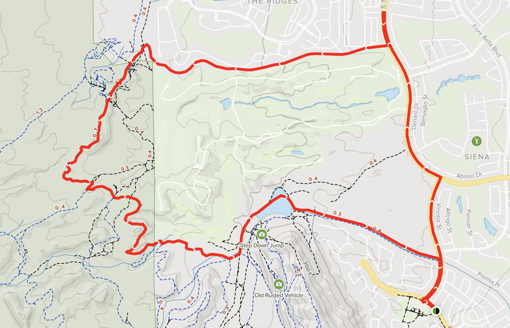

## Bears Best Trail in Las Vegas Area

I was looking for trails near Las Vegas, Nevada. I found [this](https://www.alltrails.com/trail/us/nevada/bears-best-trail-loop) gem in Boulder City, Nevada. 

This 8-mile trail was my answer. It was brutally hot! I believe this is considered a moderate route. I happened to get lost a bit but found my way, eventually. The view of the city is cool from atop the mountain, too. There is absolutely no shade, so prepare well for the heat. In the end, the downhill section was worth it.

I wish there were a few more jump features and drops. The main downhill section is a great thrill, though. 

## Full Video
Full video, including first person [GoPro Hero 10 (Amazon Affilate Link)](https://amzn.to/3frhrdn) footage, is down below. 

<iframe src='https://www.youtube.com/embed/Tqa4W-tlF1w' frameborder='0' allowfullscreen></iframe>

As an Amazon Associate, I earn from qualifying purchases. I used this battery pack and GoPro Hero 10 to film this adventure.

<iframe sandbox="allow-popups allow-scripts allow-modals allow-forms allow-same-origin" style="width:120px;height:240px;" marginwidth="0" marginheight="0" scrolling="no" frameborder="0" src="//ws-na.amazon-adsystem.com/widgets/q?ServiceVersion=20070822&OneJS=1&Operation=GetAdHtml&MarketPlace=US&source=ss&ref=as_ss_li_til&ad_type=product_link&tracking_id=kit-my_streaming-20&language=en_US&marketplace=amazon&region=US&placement=B0B96H7LGX&asins=B0B96H7LGX&linkId=d22fff55c8041cc39054aa8bb7651452&show_border=true&link_opens_in_new_window=true"></iframe>

<iframe sandbox="allow-popups allow-scripts allow-modals allow-forms allow-same-origin" style="width:120px;height:240px;" marginwidth="0" marginheight="0" scrolling="no" frameborder="0" src="//ws-na.amazon-adsystem.com/widgets/q?ServiceVersion=20070822&OneJS=1&Operation=GetAdHtml&MarketPlace=US&source=ss&ref=as_ss_li_til&ad_type=product_link&tracking_id=kit-my_streaming-20&language=en_US&marketplace=amazon&region=US&placement=B08KWDBHTN&asins=B08KWDBHTN&linkId=0346d2fa80121aaa457e49ddf398f5ad&show_border=true&link_opens_in_new_window=true"></iframe>
